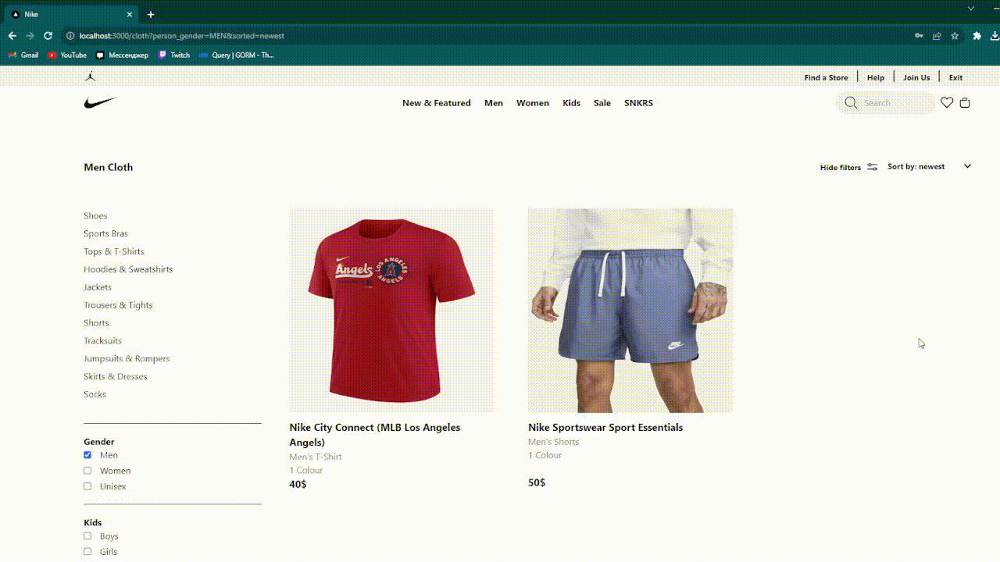
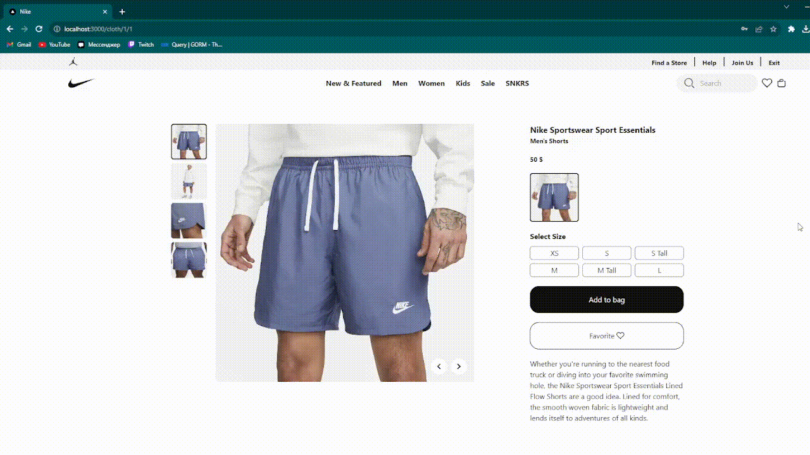
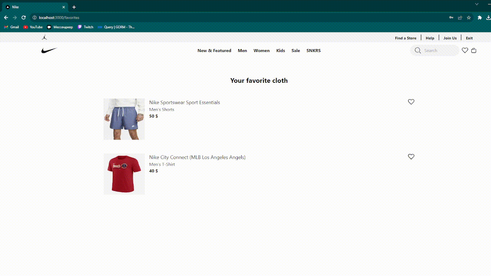

# Проект - копия интернет магазина Nike.com

## Stack

* Frontend:
    + Next.js
    + Typescript
    + Tailwind
* Backend
    + Golang - библиотеки GIN и Gorm
    + PostgreSQL

## Что было сделано

### Главная страница

Были созданы собственные списки, с бесконечной прокруткой и без. С помощью дженериков можно 
создавать списки из элементов разных типов и компонентов.

### Каталог одежды

* Фильтры по типу одежды
* Cортировка по возрастанию/убыванию цены, по новизне
* Поиск по названию

### Страница элемента одежды

* Фотографии одежды
* Возможные расцветки одежды
* Возможность добавить одежду в список понравившихся или в корзину

### Корзина

* Возможность удалить одежду из текущей корзины
* Возможность оплатить текущую корзину
* Можно просмотреть предыдущие оплаченные покупки

### Понравившаяся одежда

### Авторизация, регистрация и аутентификация

Аунтетификация реализована с помощью JWT-токена

### Адаптивность под разные типы и виды устройств

